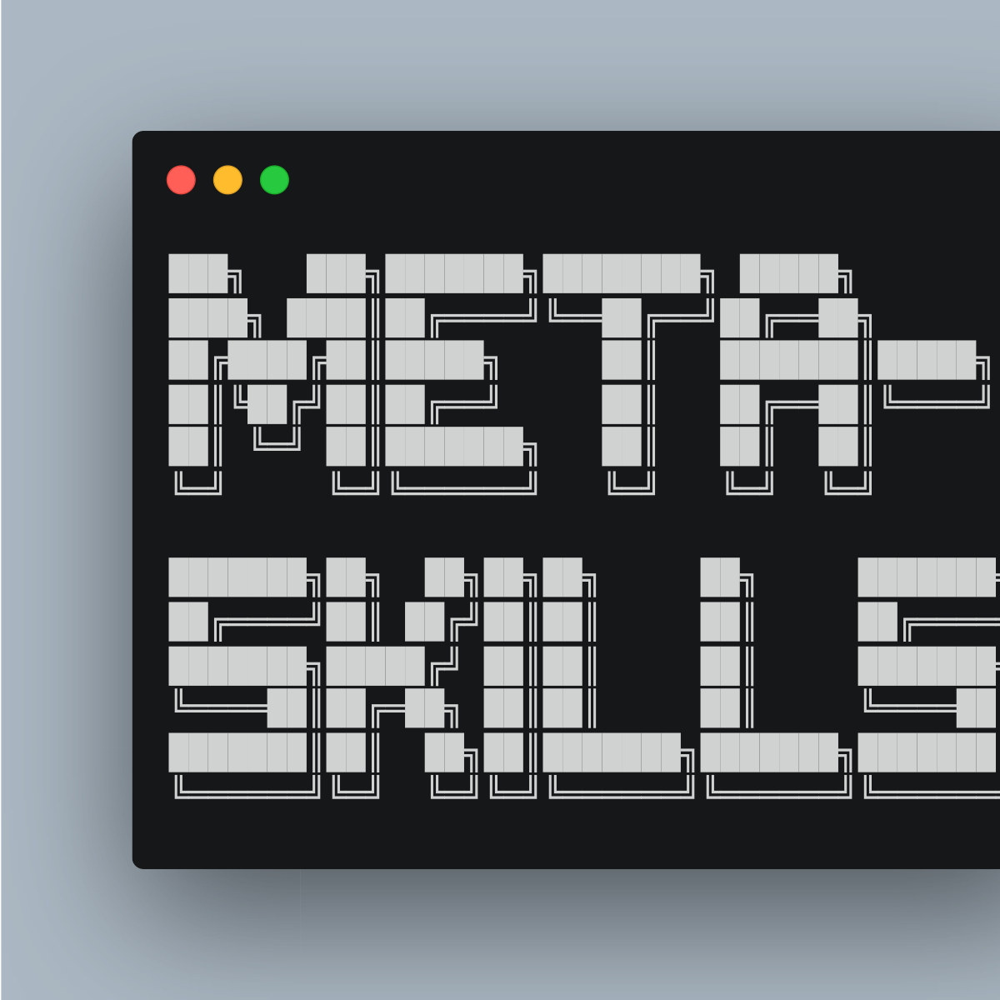

# meta-skills

  

---

Notes on skills that find, create, analyze, and ship other skills.

> [!NOTE]
> Still figuring out how the meta-skills ecosystem works. This is what I've found so far.
>
> Part curation, part learning log. I'll keep pushing what I learn here. Star the repo to follow along.

### What are skills

1. **Skills originated from Anthropic's Claude Code** as a reusable SKILL.md instruction file format.
2. **The format spread.** OpenAI adopted AGENTS.md for Codex. Cursor has its own rules format.
3. **Same idea across platforms:** a standing brief the agent reads before work starts.

### Why skills matter

1. **Context determines agent quality.** Skills are reusable instruction files (SKILL.md, AGENTS.md, CLAUDE.md) that inject domain knowledge, coding standards, and workflow patterns at execution time.
2. **Without skills, every session starts from zero.** With skills, agents carry institutional knowledge across conversations, teams, and projects.

## Contents

Organized loosely. Sections grow as I dig in.

1. [Find](#find): discovery tools and CLIs
2. [Create](#create): scaffold, generate, template
3. [Analyze](#analyze): lint, audit, validate, security
4. [Portfolios](#portfolios): curated collections and awesome-lists
5. [Platforms](#platforms): registries, specs, package managers
6. [Resources](#resources): blog posts, papers, official docs

---

## Find

> Tools and CLIs that help you discover and install skills.

| Name | Author | ⭐ | Description |
|------|--------|----|-------------|
| [find-skills](https://github.com/vercel-labs/skills) | vercel-labs | 10.2k | `npx skills` — the leading CLI for finding and installing agent skills across platforms. |
| [directories](https://github.com/leerob/directories) | leerob | 3.9k | Search engine for rules and MCP servers. Successor to cursor.directory. |

## Create

> Tools that scaffold, generate, and template agent skills and rules.

| Name | Author | ⭐ | Description |
|------|--------|----|-------------|
| [skill-creator](https://github.com/anthropics/skills/tree/main/skills/skill-creator) | anthropics | 93.2k | Anthropic's official skill creator. The reference implementation for building Claude Code skills. |
| [refly](https://github.com/refly-ai/refly) | refly-ai | 7.0k | Open-source agent skills builder. Define skills by vibe workflow, run on Claude Code, Cursor, Codex. |

## Analyze

> Lint, audit, validate, and security-review skills before you ship them.

| Name | Author | ⭐ | Description |
|------|--------|----|-------------|
| [claude-reflect](https://github.com/BayramAnnakov/claude-reflect) | BayramAnnakov | 816 | Self-learning system that captures corrections and preferences, syncs to CLAUDE.md and AGENTS.md. |
| [skill-scanner](https://github.com/getsentry/skills/tree/main/skill-scanner) | getsentry | 402 | Sentry's skill scanner for auditing and validating agent skills. Part of Sentry's skills repo. |
| [clawsec](https://github.com/prompt-security/clawsec) | prompt-security | 750 | Security skill suite: drift detection, security recommendations, automated audits, skill integrity verification. |

## Portfolios

> Curated collections and awesome-lists of skills, rules, and agent configs.

| Name | Author | ⭐ | Description |
|------|--------|----|-------------|
| [awesome-mcp-servers](https://github.com/punkpeye/awesome-mcp-servers) | punkpeye | 83.1k | The definitive MCP server collection. |
| [awesome-claude-skills](https://github.com/ComposioHQ/awesome-claude-skills) | ComposioHQ | 43.9k | Curated list of Claude Skills, resources, and tools. |
| [awesome-cursorrules](https://github.com/PatrickJS/awesome-cursorrules) | PatrickJS | 38.4k | Configuration files that enhance Cursor AI with custom rules. |
| [awesome-openclaw-skills](https://github.com/VoltAgent/awesome-openclaw-skills) | VoltAgent | 37.2k | 5,400+ skills filtered and categorized from OpenClaw Skills Registry. |
| [awesome-claude-code](https://github.com/hesreallyhim/awesome-claude-code) | hesreallyhim | 28.1k | Skills, hooks, slash-commands, agent orchestrators, plugins for Claude Code. |
| [awesome-copilot](https://github.com/github/awesome-copilot) | github | 25.1k | Community-contributed instructions, agents, skills, configs for GitHub Copilot. |
| [awesome-agent-skills](https://github.com/VoltAgent/awesome-agent-skills) | VoltAgent | 11.2k | 500+ agent skills from official dev teams and community, multi-platform. |
| [awesome-claude-code-subagents](https://github.com/VoltAgent/awesome-claude-code-subagents) | VoltAgent | 13.8k | 100+ specialized Claude Code subagents. |
| [agents.md](https://github.com/agentsmd/agents.md) | agentsmd | 18.9k | AGENTS.md — a simple, open format for guiding coding agents. |

## Platforms

> Registries, specs, and package managers that power the skill ecosystem.

| Name | Author | ⭐ | Description |
|------|--------|----|-------------|
| [skills](https://github.com/anthropics/skills) | anthropics | 93.2k | Official Anthropic public repository for Agent Skills. |
| [openclaw](https://github.com/openclaw/openclaw) | openclaw | 312k | Personal AI assistant platform with built-in skills registry. |
| [superpowers](https://github.com/obra/superpowers) | obra | 82.5k | Agentic skills framework and software development methodology. |
| [claude-mem](https://github.com/thedotmack/claude-mem) | thedotmack | 34.8k | Claude Code plugin that captures session context and reinjects it into future sessions. |
| [skills](https://github.com/openai/skills) | openai | 14.2k | Skills Catalog for Codex. OpenAI's official skill registry. |
| [agentskills](https://github.com/agentskills/agentskills) | agentskills | 13.1k | The Agent Skills specification and documentation. Aims to be the OpenAPI of agent skills. |
| [claude-plugins-official](https://github.com/anthropics/claude-plugins-official) | anthropics | 11.0k | Official Anthropic-managed directory of Claude Code Plugins. |

---

## Resources

### Best Practices

1. [Claude Code: Complete Guide to Building Skills](https://docs.anthropic.com/en/docs/claude-code/skills): Anthropic's official skill authoring guide. (2025)
2. [Cursor: Dynamic Context Discovery](https://docs.cursor.com/context/dynamic-context-discovery): how Cursor discovers and loads skill files. (2025)
3. [Context Engineering for AI Agents](https://www.anthropic.com/research/building-effective-agents): Anthropic's research on how context shapes agent behavior. The theoretical foundation for why skills work. (2025)
4. [Claude Skills](https://simonwillison.net/2025/Jun/6/claude-skills/): Simon Willison's analysis of the Claude skills system. Clear-eyed take on what works and what's hype. (2025)

---

## Contributing

See [contributing.md](contributing.md) for submission guidelines.

Short version: open an issue first. One skill per PR. Include why it's awesome, not just what it does.

## License

To the extent possible under law, the author has waived all copyright and related rights to this work.
